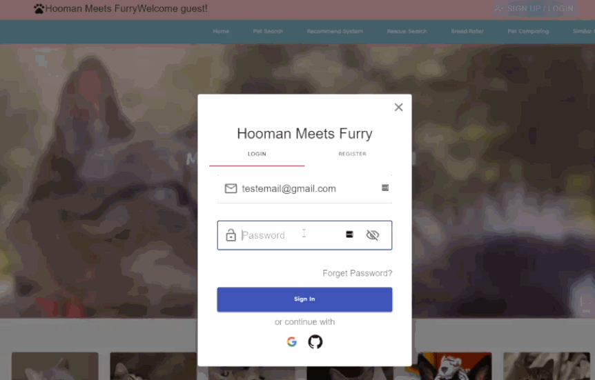
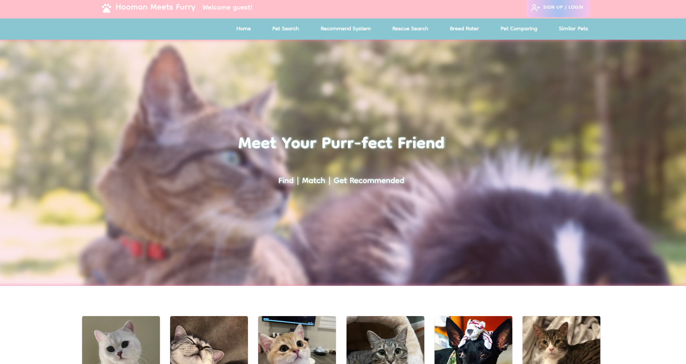
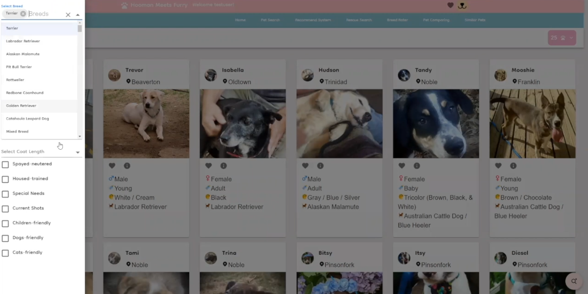
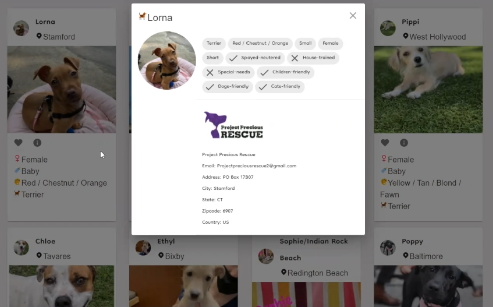
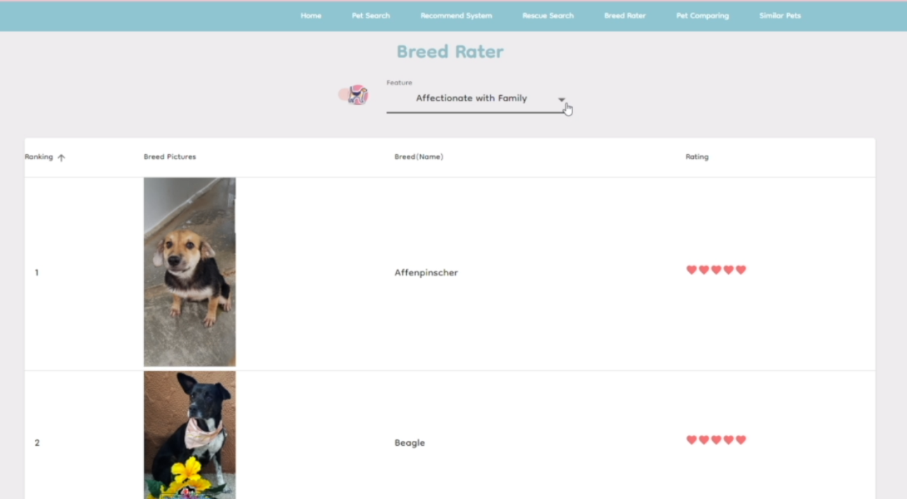
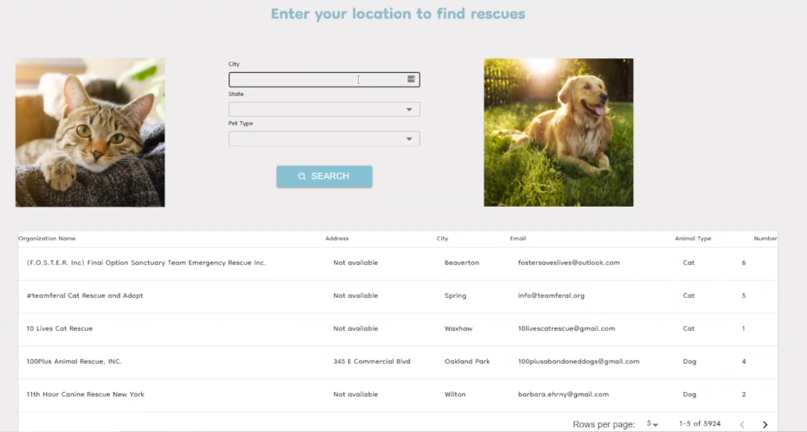
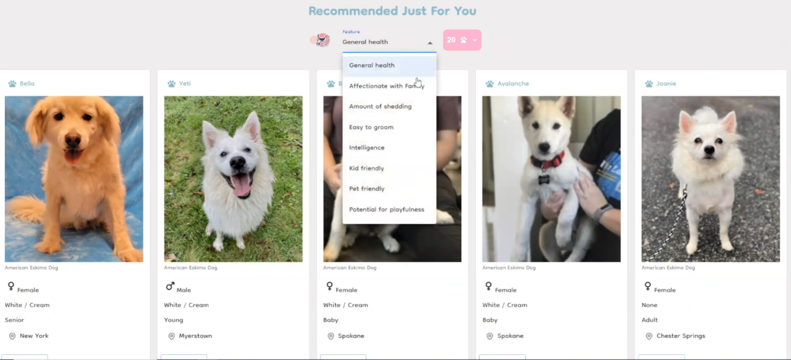
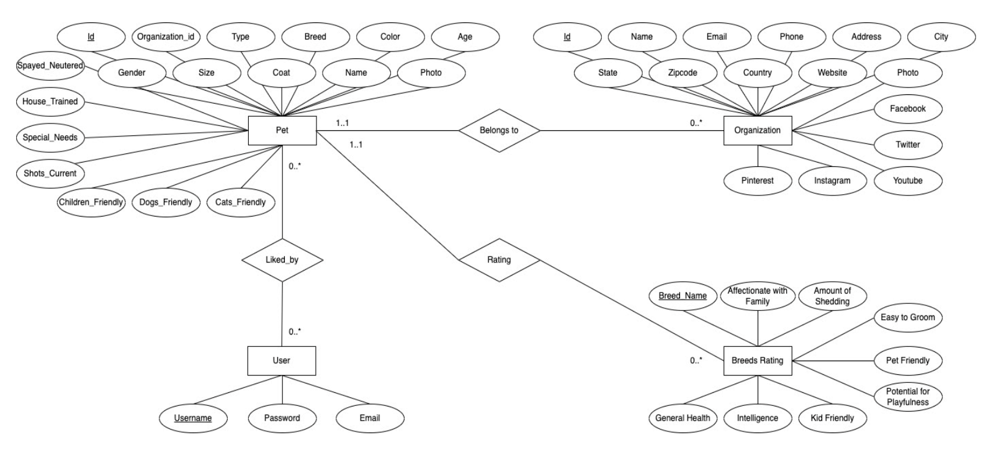

# Hooman-Meets-Furry

## Table of Contents

1. [Overview](#Overview)
2. [Features](#Features)
3. [Settings & Setups](#Settings)
4. [Schema](#Schema)

## Overview

### Description :cat:

Hooman Meets Furry aims to help users to discover and find the animal that will be right for thier family. The application we are developing recommend user their ideal pet according to user’s preferences and search in the database according to various criteria to make recommendations of the furry babies.

## Features :dog2:

### 1. Login

- Allow user to login and use the login features(Pet similar, Pet Compare and Like Page)

  

### 2. Landing

- If the user is logged in, the navigation will show user login specific features
  

### 3. Pet Search

- If user logged in, user can like/dislike the pet and it will be saved in database
  

- Allow user to make advanced search with multi selections
  
- Every pet has their info card that shows all the pet and rescue infor

<!--  -->

### 4. Breed Rater

  

### 5. Rescue Search

- Allow user to search for pet rescue according to location.
  

### 6. Pet Recommendation

- Allow user to get recommended pets according to user select attribute
  

### 7. Pet Compare

- Login required
- Allow user to select pets and see a comparision table

### 8. Pet Similar

- Login required
- Allow user to select pets from pet search page and get similar pet recommendation
  

## Settings

### Settings & Setups :electric_plug:

| Command               | Instructions                                 |
| --------------------- | -------------------------------------------- |
| `yarn install`        | Install package and dependecies              |
| `yarn start`          | Start running frontend, backend concurrently |
| `yarn start:backend`  | Start the backend server                     |
| `yarn start:frontend` | Start the frontend                           |

## API Endpoints :pushpin:

- base url: AWS EC2 database

| HTTP Verb | Endpoint                    | Description                                               |
| --------- | --------------------------- | --------------------------------------------------------- |
| GET       | /petsearch                  | Search pet by character                                   |
| GET       | /recommend                  | Recommend pet by breed feature                            |
| GET       | /rescues                    | List all rescues                                          |
| GET       | /search/rescues             | Search rescues by feature                                 |
| GET       | /top10/:type                | Display top 10 of selected features                       |
| GET       | compare/:username           | Compare pet                                               |
| GET       | /get_similar                | Find similar pets according to user                       |
| GET       | /get_all_info/id            | Get all the pet's with the corresponding including rescue |
| GET       | /get_all_pets_liked_by_user | Get the liked pets by user id                             |
| POST      | /mark_favorite              | Allow user to mark favorite pets in the pet search page   |
| POST      | /delete_favorite            | Allow user to unmark favorite pets in the pet search page |

## Schema

- ER Diagram

<!-- TODO: Add optimization and description -->

###### tags: `PetFinder`
